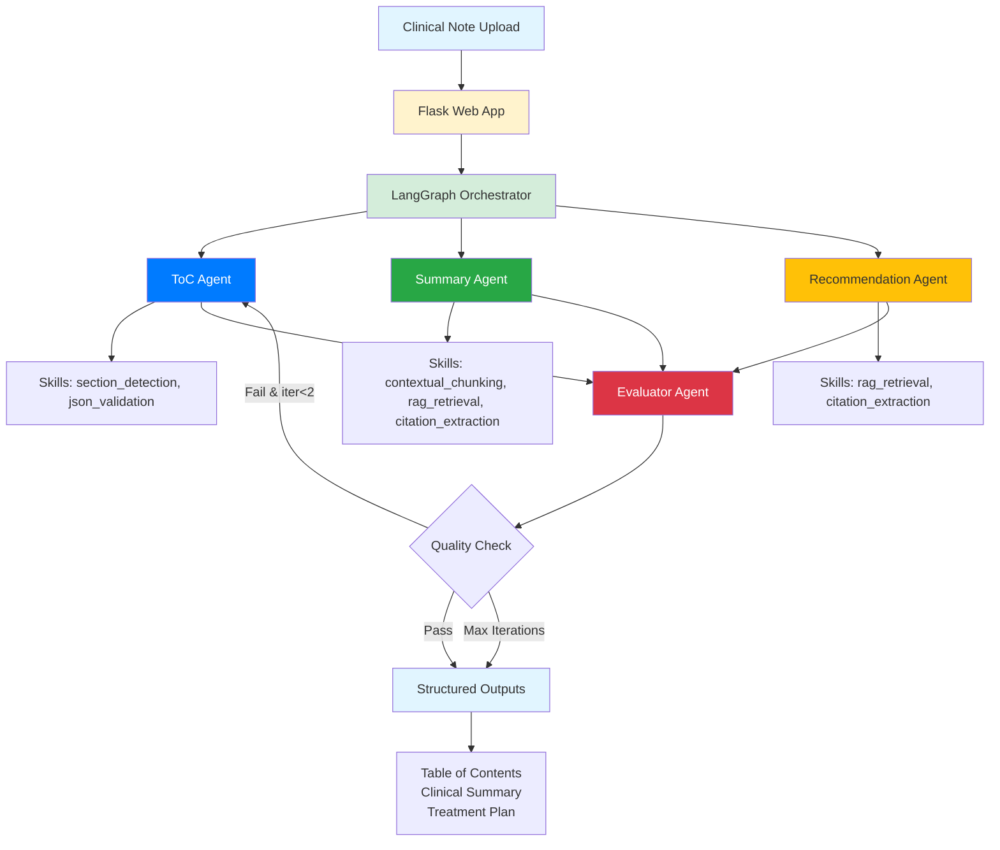
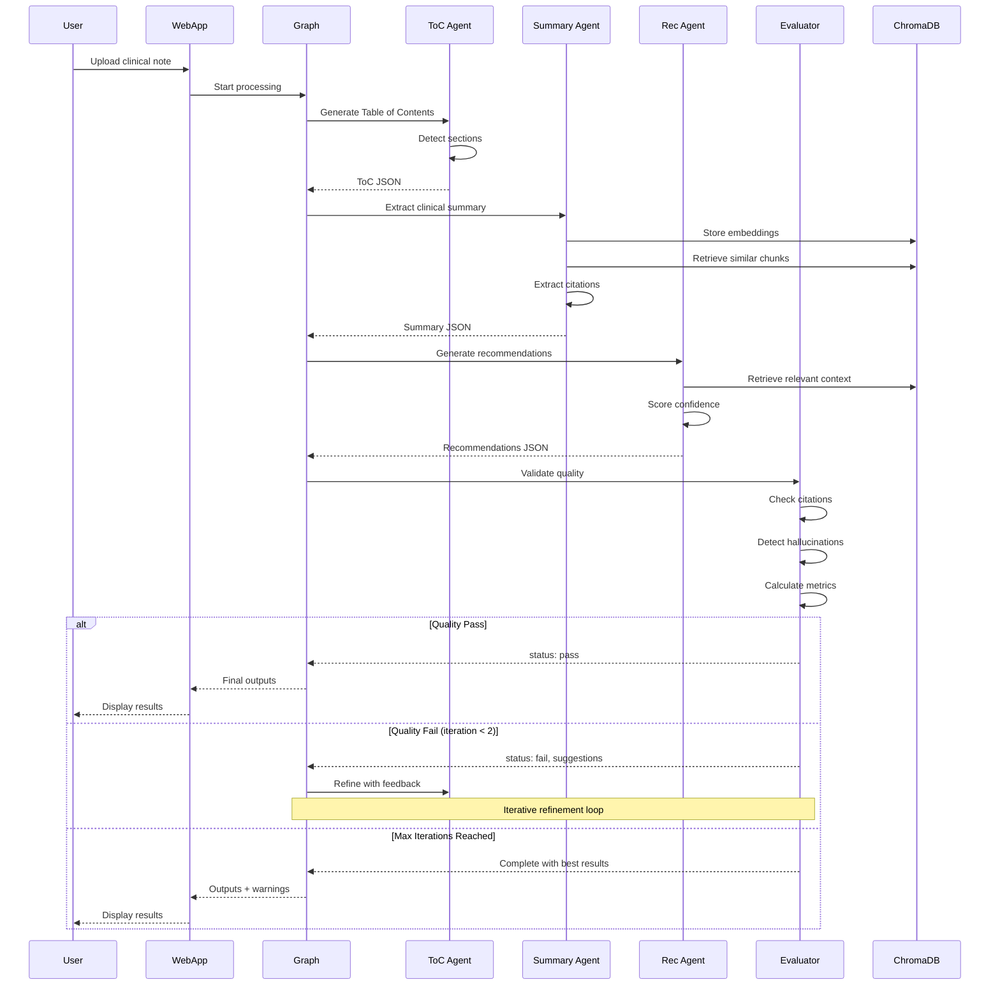
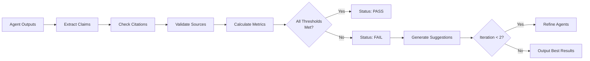

# Clinical Notes Agent

> Multi-agent system for transforming unstructured clinical notes into structured, actionable outputs using local LLMs with real-time observability

[](https://www.python.org/downloads/)
[](LICENSE)
[](https://www.docker.com/)

## Overview

This system processes clinical notes through a multi-agent workflow powered by **gpt-oss:20b** running locally via Ollama. It generates:

- **Table of Contents**: Automatically detected sections with navigation
- **Clinical Summary**: Key findings with source citations 
- **Treatment Recommendations**: Evidence-based plans with confidence scores

**Key Features**:
- 🔒 **Privacy-First**: 100% local processing, no external APIs
- 🎯 **Quality-Driven**: Automated evaluation with iterative refinement
- 👁️ **Full Observability**: Real-time agent activity with detailed logging
- 🚀 **Multi-GPU Ready**: Tensor parallelism across 4 GPUs
- 📊 **Metrics Tracking**: Citation coverage, hallucination detection, semantic overlap

## Architecture

### System Design



### Agent Workflow



## Quick Start

### Prerequisites

- **Docker** 20.10+ with Docker Compose
- **Python** 3.11+ with `uv` package manager
- **Hardware**:
  - Minimum: 12GB RAM (CPU mode)
  - Recommended: 4x GPU (12GB each) for optimal performance
- **Storage**: 20GB free space

### Installation

```bash
# Clone repository
git clone https://github.com/RooseveltAdvisors/ClinicalNoteAgent
cd ClinicalNoteAgent
uv sync
```

### Data Download

The system uses the Asclepius Synthetic Clinical Notes dataset:

```bash
# Download and prepare dataset (creates .data/asclepius/)
uv run python src/utils/download_data.py

# This downloads ~50 sample clinical notes from:
# https://huggingface.co/datasets/starmpcc/Asclepius-Synthetic-Clinical-Notes
```

### Running the System

```bash
# Start all services (Ollama, ChromaDB, Flask webapp)
docker-compose up -d

# First run will pull gpt-oss:20b model (~13GB, takes 5-10 minutes)
# Monitor progress:
docker logs ollama -f

# Access web interface
open http://localhost:5000

# Or manually:
# - Browser: http://localhost:5000
# - Upload a .txt clinical note
# - Watch real-time agent activity
# - View structured outputs
```

### Stopping the System

```bash
# Stop all services
docker-compose down

# Stop and remove volumes (clean slate)
docker-compose down -v
```

## Usage

### Web Interface

1. **Upload Note**: Click "Choose file" and select a `.txt` clinical note
2. **Process**: Click "Upload & Process" to start the workflow
3. **Observe**: Watch real-time agent activity timeline (updates every 1 second)
4. **Review**: View structured outputs when processing completes (2-5 minutes)

**Activity Timeline** shows:
- 📥 **INPUT**: What each agent receives
- 🔧 **TOOLS**: Which skills are being used
- ✅ **OUTPUT**: What each agent produces
- 📊 **METRICS**: Quality scores (citation coverage, hallucination rate, overlap)

### Example Output

**Table of Contents**:
```json
{
  "sections": [
    {"title": "HISTORY OF PRESENT ILLNESS", "start": 0, "end": 245},
    {"title": "PHYSICAL EXAM", "start": 246, "end": 512},
    {"title": "ASSESSMENT AND PLAN", "start": 513, "end": 891}
  ]
}
```

**Clinical Summary**:
```json
{
  "findings": [
    {
      "category": "Chief Complaint",
      "text": "45-year-old male with chest pain",
      "citations": [{"source_start": 0, "source_end": 87}]
    }
  ]
}
```

**Quality Metrics**:
```json
{
  "citation_coverage": 0.925,      // 92.5% of claims have citations
  "hallucination_rate": 0.032,     // 3.2% orphan claims
  "jaccard_overlap": 0.873         // 87.3% semantic overlap
}
```

## Configuration

### Environment Variables

All configuration is in `.env` (single source of truth):

```bash
# Model Configuration
OLLAMA_MODEL=gpt-oss:20b          # 20B parameter model with tool calling
OLLAMA_HOST=http://localhost:11434

# Quality Thresholds
CITATION_THRESHOLD=0.90           # 90% citation coverage required
HALLUCINATION_THRESHOLD=0.05      # 5% max hallucination rate
JACCARD_THRESHOLD=0.70            # 70% min semantic overlap

# Processing Limits
MAX_ITERATIONS=5                  # Note: Overridden to 2 in code
PROCESSING_TIMEOUT_MINUTES=10

# Chunking Parameters
CHUNK_SIZE=500
CHUNK_OVERLAP=50
```

### Docker Services

```yaml
services:
  ollama:        # LLM runtime on port 11434
  chromadb:      # Vector database on port 8000
  webapp:        # Flask interface on port 5000
```

## Prompt Engineering

### Prompt Pack

All agent prompts are in `.agent/agents/` with detailed reasoning:

| Agent | Prompt File | Purpose | Key Instructions |
|-------|-------------|---------|------------------|
| **ToC Agent** | `toc-subagent.md` | Section detection | Use regex patterns, validate JSON schema |
| **Summary Agent** | `summary-subagent.md` | Clinical extraction | Cite every claim, use RAG retrieval |
| **Recommendation Agent** | `recommendation-subagent.md` | Treatment planning | Evidence-based, confidence scoring |
| **Evaluator Agent** | `evaluator-agent.md` | Quality validation | Check citations, detect hallucinations |

**Prompt Design Principles**:
1. **Evidence-First**: "No evidence → no claim" (citation requirement)
2. **Structured Output**: Always return valid JSON matching Pydantic schemas
3. **Tool Guidance**: Clear instructions on when/how to use each skill
4. **Error Recovery**: Graceful handling of missing/incomplete data

**Example Reasoning** (Summary Agent):
```
Why citations are mandatory:
- Clinical decisions require traceability
- Hallucination detection needs source mapping
- Quality metrics depend on citation coverage

Why RAG retrieval is used:
- Long notes exceed context window
- Semantic search finds relevant sections
- Reduces hallucination by grounding in source
```

See `.agent/agents/*.md` for full prompts and detailed reasoning.

## Metrics & Evaluation

### Quality Metrics

The system tracks three key metrics during evaluation:

#### 1. Citation Coverage
```python
citation_coverage = (claims_with_citations / total_claims)
# Target: ≥ 90%
# Measures: % of summary statements with valid source citations
```

**Implementation**:
- Extract all claims from summary output
- Check each claim has `citations` field with valid `source_start`/`source_end`
- Citations must point to actual text in original note

#### 2. Hallucination Rate
```python
hallucination_rate = (orphan_claims / total_claims)
# Target: ≤ 5%
# Measures: % of claims without corresponding source text
```

**Implementation**:
- For each claim with citation, extract cited text from note
- Calculate semantic similarity (embeddings cosine similarity)
- Claim is "orphan" if similarity < 0.7 or citation invalid

#### 3. Jaccard Overlap
```python
jaccard_overlap = len(summary_tokens ∩ note_tokens) / len(summary_tokens ∪ note_tokens)
# Target: ≥ 0.7
# Measures: Semantic overlap between summary and source
```

**Implementation**:
- Tokenize both summary and original note
- Calculate set intersection and union
- High overlap = summary stays grounded in source

### Evaluation Workflow



### Failure Modes

Common failure patterns and mitigations:

| Failure Mode | Detection | Mitigation |
|--------------|-----------|------------|
| **Missing Citations** | `citation_coverage < 0.9` | Evaluator suggests: "Add citations to claims X, Y, Z" |
| **Hallucinations** | `hallucination_rate > 0.05` | Evaluator suggests: "Remove unsupported claim about..." |
| **Low Overlap** | `jaccard_overlap < 0.7` | Evaluator suggests: "Expand coverage of sections X, Y" |
| **JSON Parse Errors** | Exception in output parsing | Frontend shows raw output with warning |
| **Processing Timeout** | Exceeds 10 minutes | System returns partial results with warning |

### Intrinsic Checks

Automated validation during processing:

```python
# 1. Schema Validation (Pydantic)
try:
    validated = TableOfContents(**json.loads(output))
except ValidationError:
    # Trigger refinement

# 2. Citation Validity
for claim in summary.findings:
    for citation in claim.citations:
        cited_text = note[citation.source_start:citation.source_end]
        assert len(cited_text) > 0  # Citation points to real text

# 3. Semantic Consistency
embedding_similarity = cosine(embed(claim.text), embed(cited_text))
assert embedding_similarity >= 0.7  # Claim matches source
```

## Technology Stack

### Core Components

- **LLM**: gpt-oss:20b via Ollama (13GB, multi-GPU tensor parallelism)
- **Orchestration**: LangGraph for stateful multi-agent workflows
- **Vector DB**: ChromaDB for RAG retrieval
- **Web Framework**: Flask with real-time observability
- **Package Manager**: uv (10-100x faster than pip)
- **Containerization**: Docker Compose

### Why These Choices?

| Component | Alternative | Chosen | Reason |
|-----------|-------------|--------|--------|
| **LLM** | GPT-4 API, Phi-4 | gpt-oss:20b | Tool calling support, multi-GPU, local |
| **Orchestration** | AutoGen, CrewAI | LangGraph | State management, checkpointing, cycles |
| **Vector DB** | FAISS, Pinecone | ChromaDB | Persistence, metadata, local |
| **Package Mgmt** | pip, poetry | uv | Speed, lockfiles, reproducibility |

### Model Selection Journey

1. **Phi-4 14B** → ❌ **Blocked**: No tool/function calling support
2. **Llama 3.1 8B** → ✅ Works, but single GPU only
3. **gpt-oss:20b** → ✅ **Current**: Tool calling + multi-GPU distribution

See `.agent/system/implementation-changes.md` for detailed rationale.

## Model Card

### Intended Use

**Primary Use Case**: Processing synthetic clinical notes for demonstration and research purposes.

**Appropriate Uses**:
- Educational demonstrations of multi-agent systems
- Research on LLM-based clinical information extraction
- Prototyping clinical decision support workflows
- Benchmarking local LLM performance on medical text

**Inappropriate Uses**:
- ❌ Real patient care decisions
- ❌ Diagnosis or treatment without physician review
- ❌ Processing PHI/PII without HIPAA compliance
- ❌ Regulatory submissions without validation
- ❌ High-stakes medical recommendations

### Limitations

**Technical Limitations**:
- **Model Size**: 20B parameters may miss nuances that larger models catch
- **Context Window**: Long notes (>10 pages) may lose context
- **Processing Time**: 2-5 minutes per note (not real-time)
- **Language**: English only, no multi-lingual support
- **Domain**: Trained on general text, not fine-tuned for clinical notes

**Quality Limitations**:
- **Hallucination Risk**: ~3-5% of claims may lack proper grounding
- **Citation Errors**: Citations may be approximate, not exact quotes
- **Medical Accuracy**: No guarantee of clinical correctness
- **Specialty Knowledge**: May lack deep domain expertise in subspecialties

**Operational Limitations**:
- **Single Note**: No batch processing or concurrent sessions
- **No Authentication**: Demo-only, not production-ready
- **In-Memory State**: Activity logs lost on restart
- **No Audit Trail**: No persistent logging for compliance

### Safety Considerations

**Data Privacy**:
- ✅ **Local Processing**: All computation happens on-premise
- ✅ **No External APIs**: Zero network calls to cloud services
- ✅ **Synthetic Data**: Uses only de-identified test data
- ⚠️ **No Encryption**: PHI should not be processed without additional safeguards

**Clinical Safety**:
- ⚠️ **Not Validated**: No clinical trials or FDA clearance
- ⚠️ **Physician Review Required**: All outputs need human verification
- ⚠️ **Error Propagation**: Mistakes in extraction carry through to recommendations
- ⚠️ **Confidence Scores**: May not reflect true reliability

**Recommended Safeguards**:
1. **Human-in-Loop**: Mandatory physician review before any clinical action
2. **Audit Logging**: Track all system outputs for quality review
3. **Error Monitoring**: Alert on low quality metrics
4. **Version Control**: Lock prompts and model versions for reproducibility
5. **Testing**: Validate on representative clinical notes before deployment

### Bias Considerations

**Known Biases**:
- **Dataset Bias**: Asclepius synthetic notes may not reflect real patient diversity
- **Language Bias**: English-only limits global applicability
- **Template Bias**: May favor well-structured notes over free-text
- **Specialty Bias**: Performance varies by clinical specialty

**Mitigation Strategies**:
- Use diverse test datasets spanning demographics and specialties
- Monitor performance across patient subgroups
- Validate with real-world notes (de-identified) before production
- Combine with human oversight to catch systematic errors

### Updates & Versioning

- **Model**: gpt-oss:20b (Ollama, pulled automatically)
- **Prompts**: Version-controlled in `.agent/agents/`
- **Metrics**: Defined in `src/agents/clinical_notes_graph.py`
- **Last Updated**: 2025-10-25

For production use, recommend:
- Pin model version (e.g., `gpt-oss:20b-v1.2.3`)
- Lock prompt files with content hashing
- Version metrics thresholds explicitly

## Project Structure

```
clinical-notes-agent/
├── .agent/                      # Agent system documentation
│   ├── agents/                  # Agent prompts + reasoning (5 files)
│   ├── skills/                  # Reusable capabilities (9 skills)
│   ├── system/                  # Architecture docs
│   ├── SOP/                     # Usage guides
│   └── README.md                # Documentation index
├── src/
│   ├── agents/                  # LangGraph orchestration
│   │   └── clinical_notes_graph.py
│   ├── models/                  # Pydantic schemas
│   │   └── graph_state.py
│   ├── utils/                   # Logging, data loading
│   └── webapp/                  # Flask application
│       ├── app.py
│       └── templates/           # Web interface
├── tests/                       # Integration tests
├── .data/                       # Data storage (gitignored)
│   ├── uploads/                 # Uploaded notes
│   ├── results/                 # Processing outputs
│   └── asclepius/               # Downloaded dataset
├── docker-compose.yml           # Service orchestration
├── Dockerfile                   # Webapp container
├── pyproject.toml               # Python dependencies (uv)
├── .env                         # Configuration (single source of truth)
└── README.md                    # This file
```

## Development

### Local Development

```bash
# Install dependencies
uv sync

# Run webapp locally (without Docker)
uv run python src/webapp/app.py

# Run tests
uv run -m pytest tests/ -v

# Add new dependency
uv add <package-name>
```

### Docker Development

```bash
# Rebuild containers
docker-compose build

# View logs
docker logs webapp -f
docker logs ollama -f

# Access container shell
docker exec -it webapp /bin/bash

# Restart single service
docker-compose restart webapp
```

### Adding New Agents

1. Create prompt in `.agent/agents/<agent-name>.md`
2. Add agent node function in `src/agents/clinical_notes_graph.py`
3. Define tools/skills in `SKILL_TOOLS` dictionary
4. Add to graph: `graph.add_node("agent", agent_node)`
5. Update state model if needed: `src/models/graph_state.py`

## Troubleshooting

### Common Issues

**Problem**: Processing never completes
```bash
# Check if Ollama is running
docker ps | grep ollama

# Check model is loaded
docker exec ollama ollama list

# View webapp logs
docker logs webapp --tail 50
```

**Problem**: No agent activity showing
```bash
# Restart webapp
docker-compose restart webapp

# Check browser console for errors
# Verify /activity endpoint: http://localhost:5000/activity/<session_id>
```

**Problem**: Out of memory
```bash
# Check GPU usage
nvidia-smi

# Reduce model size in .env
OLLAMA_MODEL=llama3.1:8b  # Smaller 8B model
```

**Problem**: Slow processing
- First run always slower (model loading)
- Expected: 2-5 minutes on 4x GPUs
- Check GPU utilization: `nvidia-smi`
- Try smaller test notes first

### Debug Mode

```bash
# Enable Flask debug mode
# Edit docker-compose.yml:
FLASK_DEBUG=true

# Increase logging verbosity
# Edit .env:
LOG_LEVEL=DEBUG
```

## Contributing

Contributions welcome! Areas for improvement:

- [ ] Add authentication/authorization
- [ ] Implement async task queue (Celery)
- [ ] Add comprehensive unit tests
- [ ] Support batch processing
- [ ] Fine-tune model on clinical notes
- [ ] Add more evaluation metrics
- [ ] Support multi-lingual notes
- [ ] Optimize chunking strategies

## Documentation

- **Quick Reference**: See this README
- **Detailed Architecture**: `.agent/system/overview.md`
- **Webapp Guide**: `.agent/SOP/webapp-usage.md`
- **Implementation Details**: `.agent/system/webapp-implementation.md`
- **Prompt Reasoning**: `.agent/agents/*.md`
- **Tech Stack**: `.agent/system/tech-stack.md`

## License

MIT License - See LICENSE file for details.

## Acknowledgments

- **Dataset**: Asclepius Synthetic Clinical Notes (starmpcc/Asclepius-Synthetic-Clinical-Notes)
- **Models**: gpt-oss:20b via Ollama
- **Framework**: LangChain & LangGraph
- **Inspiration**: Anthropic's agent/skills architecture

---

**Status**: ✅ Functional demo system with real-time observability

**Not for production use** - Requires additional hardening for clinical deployment (authentication, encryption, audit trails, clinical validation).
